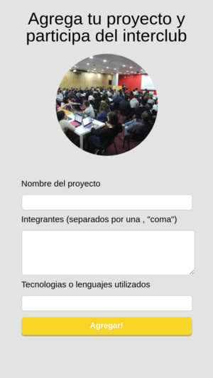
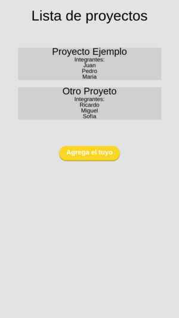

# Ejemplos y tutoriales usando firebase

### Ejemplo de Manejo de Stock en entorno web

[Ver aquí](https://ptf-houssay.github.io/ptf-firebase/stock/)

### Proyecto mobile para registrar proyectos en desarrollo

[Ver aquí](https://ptf-houssay.github.io/ptf-firebase/proyectos/)
